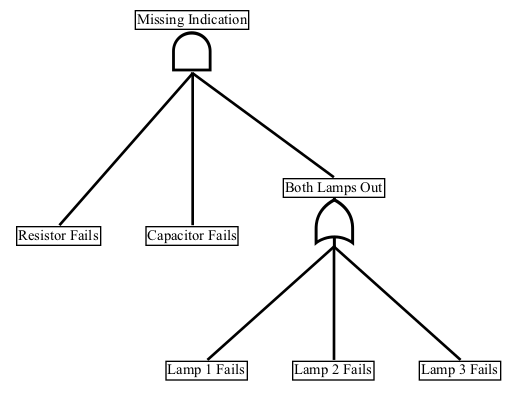

# SE4101-Fault-Tree-Analysis

This repository contains resources for fault tree analysis using [PyML](https://github.com/madachy/PyML).  The file _fault_tree_example.py_ shows an example creation of a fault tree diagram for the lamp circuit fault tree example shown below.  

## Spreadsheet Instructions
A fault tree can be defined in a spreadsheet using the following conventions and then read with PyML for analysis and visualization. The top event must be in the first row, but all other events can be in any order.  They may be grouped by their event paths or by hierarchical levels as convenient.  An event types can be a conditional _and_, conditional _or_, or _basic_ event (leaf).  The following are valid designations for event types:

|Event Type | Acceptable Spellings |
|:-|:-|
|And | "And" "and" "AND" |
|Or | "Or" "or" "OR" |
|Basic | "Basic" "basic" "BASIC"

## Spreadsheet Instructions

The example fault tree below is specified using the provided template file 'fault tree example.xls' shown underneath.

The template provided can be modified for new fault trees.

